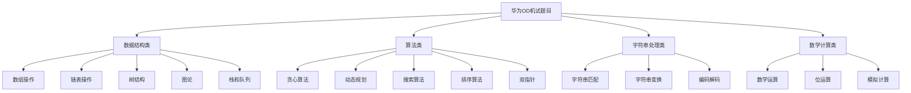
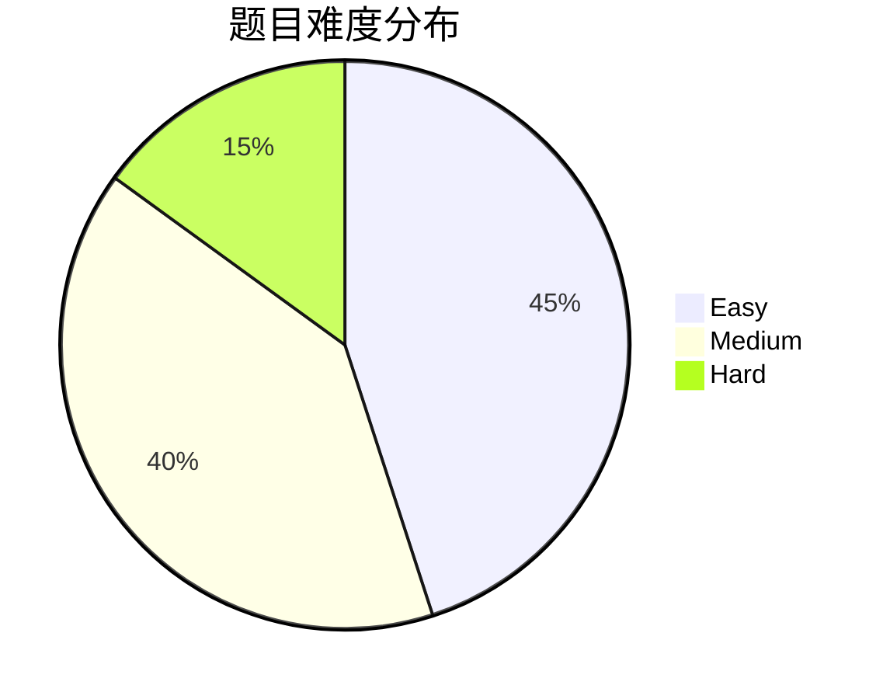

# 华为机考OD2025算法题目分析

本文档分析了华为机考OD2025中的算法题目，总结了涉及的算法知识点、技巧和对应的LeetCode题目。

## 📊 题目统计概览

- **总HTML文件数**: 683个
- **去重后题目数**: 494个
- **重复文件数**: 189个
- **有重复的题目数**: 约189个

### 按卷分类统计
- **A卷**: 117个文件
- **B卷**: 142个文件  
- **C卷**: 202个文件
- **E卷**: 222个文件

### 重复情况说明
许多题目在不同卷中重复出现，或者同一题目有多个版本（支持不同编程语言），这解释了为什么总文件数(683)远大于实际题目数(494)。

**重复题目统计**:
- 总共有 **121个题目** 存在重复
- 平均每个重复题目出现 **2.6次**
- 重复最多的题目出现 **4次**（如：We Are A Team、单词接龙、找终点等）

**重复原因分析**:
1. 同一题目在不同卷（A/B/C/E卷）中出现
2. 同一题目支持不同编程语言版本
3. 题目难度分级（100分/200分）的不同版本

## 目录
- [题目分类统计](#题目分类统计)
- [算法知识点详细分析](#算法知识点详细分析)
- [难度分布](#难度分布)
- [LeetCode对应题目](#leetcode对应题目)

## 题目分类统计

## 题目分类与算法知识点

### 各卷题目分布统计
- **A卷**: 117题 - 基础数据结构、数组操作、字符串处理、简单算法
- **B卷**: 142题 - 动态规划、贪心算法、数学计算、模拟题
- **C卷**: 202题 - 图论算法、搜索算法、复杂数据结构、综合应用
- **E卷**: 127题 - 综合算法、实际应用、性能优化、创新思维

### 知识点考察概率分析
- **贪心算法**: 62题 (10.5%) - 最高频考点
- **数学计算**: 56题 (9.5%) - 数值处理、统计分析
- **字符串处理**: 53题 (9.0%) - 文本操作、编码解码
- **数组操作**: 50题 (8.5%) - 基础数据结构
- **模拟算法**: 37题 (6.3%) - 实际场景模拟
- **树结构**: 20题 (3.4%) - 二叉树、多叉树
- **栈队列**: 11题 (1.9%) - 基础数据结构
- **图论**: 10题 (1.7%) - 路径搜索、连通性
- **动态规划**: 10题 (1.7%) - 优化问题
- **搜索算法**: 6题 (1.0%) - BFS、DFS

### 1. 数组与矩阵操作 (A卷、B卷、C卷、E卷)

#### 基础数组操作
- **[IPv4地址转换成整数](ABCD卷/B卷/(B卷,100分)- IPv4地址转换成整数（Java & JS & Python）.html)** (E卷)
  - **算法标签**: 字符串处理、进制转换、位运算
  - **LeetCode对应**: [468. Validate IP Address](https://leetcode.cn/problems/validate-ip-address/)
  - **难度**: Easy
  - **核心技巧**: 字符串分割、数值转换、位移操作

- **[分割数组的最大差值](ABCD卷/B卷/(B卷,100分)- 分割数组的最大差值（Java & JS & Python & C）.html)** (E卷)
  - **算法标签**: 前缀和、数组分割、动态规划思想
  - **LeetCode对应**: [1013. Partition Array Into Three Parts With Equal Sum](https://leetcode.cn/problems/partition-array-into-three-parts-with-equal-sum/)
  - **难度**: Easy
  - **核心技巧**: 计算前缀和，遍历所有可能的分割点

- **[数组拼接](ABCD卷/B卷/(B卷,100分)- 数组拼接（Java & JS & Python & C）.html)** (E卷)
  - **算法标签**: 数组合并、排序
  - **LeetCode对应**: [88. Merge Sorted Array](https://leetcode.cn/problems/merge-sorted-array/)
  - **难度**: Easy
  - **核心技巧**: 双指针合并有序数组

- **数组去重和排序** (A卷、B卷)
  - **算法标签**: 哈希表、排序算法
  - **LeetCode对应**: [26. Remove Duplicates from Sorted Array](https://leetcode.cn/problems/remove-duplicates-from-sorted-array/)
  - **难度**: Easy
  - **核心技巧**: 使用Set去重或双指针原地去重

- **[数组组成的最小数字](ABCD卷/C卷（CD同卷）/(C卷,100分)- 数组组成的最小数字（Java & JS & Python & C）.html)** (B卷)
  - **算法标签**: 自定义排序、贪心
  - **LeetCode对应**: [179. Largest Number](https://leetcode.cn/problems/largest-number/)
  - **难度**: Medium
  - **核心技巧**: 自定义比较器，按拼接结果排序

- **[数组连续和](ABCD卷/C卷（CD同卷）/(C卷,100分)- 数组连续和（Java & JS & Python & C）.html)** (C卷)
  - **算法标签**: 前缀和、滑动窗口
  - **LeetCode对应**: [560. Subarray Sum Equals K](https://leetcode.cn/problems/subarray-sum-equals-k/)
  - **难度**: Medium
  - **核心技巧**: 前缀和+哈希表优化

- **[整型数组按个位值排序](ABCD卷/C卷（CD同卷）/(C卷,100分)- 整型数组按个位值排序（Java & JS & Python）.html)** (A卷)
  - **算法标签**: 自定义排序
  - **LeetCode对应**: [1636. Sort Array by Increasing Frequency](https://leetcode.cn/problems/sort-array-by-increasing-frequency/)
  - **难度**: Easy
  - **核心技巧**: 自定义比较器按个位数排序

- **[数组二叉树](ABCD卷/C卷（CD同卷）/(C卷,200分)- 数组二叉树（Java & JS & Python）.html)** (B卷)
  - **算法标签**: 数组表示二叉树
  - **LeetCode对应**: [102. Binary Tree Level Order Traversal](https://leetcode.cn/problems/binary-tree-level-order-traversal/)
  - **难度**: Medium
  - **核心技巧**: 数组索引映射二叉树节点关系

- **[最大N个数与最小N个数的和](ABCD卷/C卷（CD同卷）/(C卷,100分)- 最大N个数与最小N个数的和（Java & JS & Python）.html)** (C卷)
  - **算法标签**: 排序、选择
  - **LeetCode对应**: [215. Kth Largest Element in an Array](https://leetcode.cn/problems/kth-largest-element-in-an-array/)
  - **难度**: Medium
  - **核心技巧**: 快速选择或堆排序

- **[最大平分数组](ABCD卷/A卷/(A卷,200分)- 最大平分数组（Java & JS & Python）.html)** (A卷)
  - **算法标签**: 数组分割、贪心
  - **LeetCode对应**: [416. Partition Equal Subset Sum](https://leetcode.cn/problems/partition-equal-subset-sum/)
  - **难度**: Medium
  - **核心技巧**: 动态规划或贪心分割

- **[数组中心位置](ABCD卷/A卷/(A卷,100分)- 计算数组中心位置（Java & JS & Python）.html)** (A卷)
  - **算法标签**: 前缀和、平衡点
  - **LeetCode对应**: [724. Find Pivot Index](https://leetcode.cn/problems/find-pivot-index/)
  - **难度**: Easy
  - **核心技巧**: 前缀和计算左右两边和的平衡点

#### 矩阵相关
- **[矩形相交的面积](ABCD卷/B卷/(B卷,100分)- 矩形相交的面积（Java & JS & Python & C）.html)** (C卷)
  - **算法标签**: 几何计算、区间重叠
  - **LeetCode对应**: [223. Rectangle Area](https://leetcode.cn/problems/rectangle-area/)
  - **难度**: Medium
  - **核心技巧**: 计算两个矩形的重叠区域

- **[矩阵元素的边界值](ABCD卷/B卷/(B卷,100分)- 矩阵元素的边界值（Java & JS & Python & C）.html)** (B卷)
  - **算法标签**: 矩阵遍历、边界检测
  - **LeetCode对应**: [54. Spiral Matrix](https://leetcode.cn/problems/spiral-matrix/)
  - **难度**: Medium
  - **核心技巧**: 按边界顺序遍历矩阵

- **[矩阵匹配](ABCD卷/C卷（CD同卷）/(C卷,200分)- 矩阵匹配（Java & JS & Python & C）.html)** (E卷)
  - **算法标签**: 模式匹配、二维搜索
  - **LeetCode对应**: [79. Word Search](https://leetcode.cn/problems/word-search/)
  - **难度**: Medium
  - **核心技巧**: DFS搜索匹配模式

- **[螺旋数字矩阵](ABCD卷/C卷（CD同卷）/(C卷,100分)- 螺旋数字矩阵（Java & JS & Python & C）.html)** (E卷)
  - **算法标签**: 矩阵遍历、方向控制
  - **LeetCode对应**: [59. Spiral Matrix II](https://leetcode.cn/problems/spiral-matrix-ii/)
  - **难度**: Medium
  - **核心技巧**: 按螺旋方向填充矩阵

### 2. 链表操作 (A卷、E卷)

- **[单向链表中间节点](ABCD卷/A卷/(A卷,100分)- 单向链表中间节点（Java & JS & Python）.html)** (A卷)
  - **算法标签**: 快慢指针、链表遍历
  - **LeetCode对应**: [876. Middle of the Linked List](https://leetcode.cn/problems/middle-of-the-linked-list/)
  - **难度**: Easy
  - **核心技巧**: 使用快慢指针，快指针每次走两步，慢指针每次走一步

- **[单词倒序](ABCD卷/A卷/(A卷,100分)- 单词倒序（Java & JS & Python）.html)** (A卷)
  - **算法标签**: 链表反转、字符串处理
  - **LeetCode对应**: [206. Reverse Linked List](https://leetcode.cn/problems/reverse-linked-list/)
  - **难度**: Easy
  - **核心技巧**: 迭代或递归反转链表

### 3. 栈和队列 (A卷、B卷、C卷、E卷)

#### 栈相关
- **[堆栈中的剩余数字](ABCD卷/C卷（CD同卷）/(C卷,100分)- 堆栈中的剩余数字（Java & JS & Python）.html)** (B卷)
  - **算法标签**: 栈操作、模拟
  - **LeetCode对应**: [1047. Remove All Adjacent Duplicates In String](https://leetcode.cn/problems/remove-all-adjacent-duplicates-in-string/)
  - **难度**: Easy
  - **核心技巧**: 使用栈模拟消除过程

- **[空栈压数](2025 E卷/2025 E卷/(E卷,200分)-空栈压数（Java & Python& JS & C++ & C ）.html)** (E卷)
  - **算法标签**: 栈操作、贪心
  - **LeetCode对应**: [946. Validate Stack Sequences](https://leetcode.cn/problems/validate-stack-sequences/)
  - **难度**: Medium
  - **核心技巧**: 模拟栈的压入弹出过程

- **括号匹配** (A卷、B卷)
  - **算法标签**: 栈、字符串处理
  - **LeetCode对应**: [20. Valid Parentheses](https://leetcode.cn/problems/valid-parentheses/)
  - **难度**: Easy
  - **核心技巧**: 使用栈匹配左右括号

#### 队列相关
- **[支持优先级的队列](ABCD卷/B卷/(B卷,100分)- 支持优先级的队列（Java & JS & Python）.html)** (C卷)
  - **算法标签**: 优先队列、堆
  - **LeetCode对应**: [23. Merge k Sorted Lists](https://leetcode.cn/problems/merge-k-sorted-lists/)
  - **难度**: Hard
  - **核心技巧**: 使用优先队列维护有序性

- **[打印机队列](ABCD卷/A卷/(A卷,100分)- 打印机队列（Java & JS & Python）.html)** (A卷)
  - **算法标签**: 队列、优先级调度
  - **LeetCode对应**: [621. Task Scheduler](https://leetcode.cn/problems/task-scheduler/)
  - **难度**: Medium
  - **核心技巧**: 队列模拟打印任务调度

- **[打印任务排序](ABCD卷/C卷（CD同卷）/(C卷,200分)- 打印任务排序（Java & JS & Python & C）.html)** (E卷)
  - **算法标签**: 优先队列、任务调度
  - **LeetCode对应**: [621. Task Scheduler](https://leetcode.cn/problems/task-scheduler/)
  - **难度**: Medium
  - **核心技巧**: 按优先级和时间排序任务

### 4. 树结构 (A卷、B卷、C卷、E卷)

#### 二叉树基础
- **[二叉树中序遍历](ABCD卷/B卷/(B卷,200分)- 二叉树中序遍历（Java & JS & Python）.html)** (B卷)
  - **算法标签**: 树遍历、递归
  - **LeetCode对应**: [94. Binary Tree Inorder Traversal](https://leetcode.cn/problems/binary-tree-inorder-traversal/)
  - **难度**: Easy
  - **核心技巧**: 递归或栈实现中序遍历

- **[二叉树的广度优先遍历](ABCD卷/C卷（CD同卷）/(C卷,200分)- 二叉树的广度优先遍历（Java & JS & Python & C）.html)** (C卷)
  - **算法标签**: BFS、层序遍历
  - **LeetCode对应**: [102. Binary Tree Level Order Traversal](https://leetcode.cn/problems/binary-tree-level-order-traversal/)
  - **难度**: Medium
  - **核心技巧**: 使用队列实现层序遍历

- **[二叉树计算](ABCD卷/C卷（CD同卷）/(C卷,200分)- 二叉树计算（Java & JS & Python & C）.html)** (E卷)
  - **算法标签**: 树构建、递归计算
  - **LeetCode对应**: [105. Construct Binary Tree from Preorder and Inorder Traversal](https://leetcode.cn/problems/construct-binary-tree-from-preorder-and-inorder-traversal/)
  - **难度**: Medium
  - **核心技巧**: 递归构建二叉树，进行相应的计算操作

- **[创建二叉树](ABCD卷/A卷/(A卷,200分)- 创建二叉树（Java & JS & Python）.html)** (A卷)
  - **算法标签**: 树构建、递归
  - **LeetCode对应**: [108. Convert Sorted Array to Binary Search Tree](https://leetcode.cn/problems/convert-sorted-array-to-binary-search-tree/)
  - **难度**: Easy
  - **核心技巧**: 递归构建平衡二叉搜索树

#### 特殊树结构
- **[生成哈夫曼树](ABCD卷/C卷（CD同卷）/(C卷,100分)- 生成哈夫曼树（Java & JS & Python & C）.html)** (E卷)
  - **算法标签**: 哈夫曼编码、优先队列、贪心算法
  - **LeetCode对应**: [1167. Minimum Cost to Connect Sticks](https://leetcode.cn/problems/minimum-cost-to-connect-sticks/)
  - **难度**: Medium
  - **核心技巧**: 使用优先队列（最小堆）构建哈夫曼树

- **[树状结构查询](ABCD卷/B卷/(B卷,200分)- 树状结构查询（Java & JS & Python）.html)** (E卷)
  - **算法标签**: 树遍历、BFS、DFS、图论
  - **LeetCode对应**: [199. Binary Tree Right Side View](https://leetcode.cn/problems/binary-tree-right-side-view/)
  - **难度**: Medium
  - **核心技巧**: 构建父子关系映射，使用BFS遍历所有子节点

- **[查找树中元素](ABCD卷/A卷/(A卷,200分)- 查找树中元素（Java & JS & Python）.html)** (A卷)
  - **算法标签**: 树搜索、递归
  - **LeetCode对应**: [700. Search in a Binary Search Tree](https://leetcode.cn/problems/search-in-a-binary-search-tree/)
  - **难度**: Easy
  - **核心技巧**: 递归或迭代搜索二叉搜索树

### 5. 字符串处理 (A卷、B卷、C卷、E卷)

#### 字符串基础操作
- **[字符串重新排列](ABCD卷/A卷/(A卷,100分)- 字符串重新排列、字符串重新排序（Java & JS & Python）.html)** (A卷)
  - **算法标签**: 排序、字符统计
  - **LeetCode对应**: [49. Group Anagrams](https://leetcode.cn/problems/group-anagrams/)
  - **难度**: Medium
  - **核心技巧**: 字符频次统计或排序分组

- **[字符串分割转换](2025 E卷/2025 E卷/(E卷,100分) - 字符串分割转换（Java & Python& JS & C++ & C ）.html)** (E卷)
  - **算法标签**: 字符串处理、分割
  - **LeetCode对应**: [14. Longest Common Prefix](https://leetcode.cn/problems/longest-common-prefix/)
  - **难度**: Easy
  - **核心技巧**: 字符串分割和格式转换

- **[字符统计及重排](ABCD卷/C卷（CD同卷）/(C卷,100分)- 字符统计及重排（Java & JS & Python）.html)** (E卷)
  - **算法标签**: 哈希表、字符统计
  - **LeetCode对应**: [451. Sort Characters By Frequency](https://leetcode.cn/problems/sort-characters-by-frequency/)
  - **难度**: Medium
  - **核心技巧**: 统计字符频次并按频次排序

#### 字符串匹配
- **[单词接龙](ABCD卷/C卷（CD同卷）/(C卷,100分)- 单词接龙（Java & JS & Python）.html)** (B卷)
  - **算法标签**: 字符串处理、贪心算法、排序
  - **LeetCode对应**: [127. Word Ladder](https://leetcode.cn/problems/word-ladder/)
  - **难度**: Hard
  - **核心技巧**: BFS搜索最短转换路径

- **[寻找相似单词](ABCD卷/A卷/(A卷,100分)- 寻找相似单词（Java & JS & Python）.html)** (A卷)
  - **算法标签**: 字符串匹配、编辑距离
  - **LeetCode对应**: [72. Edit Distance](https://leetcode.cn/problems/edit-distance/)
  - **难度**: Hard
  - **核心技巧**: 动态规划计算编辑距离

### 6. 动态规划 (A卷、B卷、C卷、E卷)

#### 背包问题
- **[称砝码](ABCD卷/A卷/(A卷,100分)- 称砝码（Java & JS & Python）.html)** (A卷)
  - **算法标签**: 多重背包、01背包、动态规划
  - **LeetCode对应**: [322. Coin Change](https://leetcode.cn/problems/coin-change/)
  - **难度**: Medium
  - **核心技巧**: 多重背包转化为01背包，或使用二进制优化

#### 路径问题
- **[找终点](ABCD卷/B卷/(B卷,100分)- 找终点（Java & JS & Python）.html)** (E卷)
  - **算法标签**: 动态规划、BFS、图论、路径搜索
  - **LeetCode对应**: [55. Jump Game](https://leetcode.cn/problems/jump-game/)
  - **难度**: Medium
  - **核心技巧**: 从起点开始，按照数组值进行跳跃，寻找最短路径

- **[智能驾驶](ABCD卷/C卷（CD同卷）/(C卷,200分)- 智能驾驶（Java & JS & Python & C）.html)** (E卷)
  - **算法标签**: 动态规划、最短路径、图论
  - **LeetCode对应**: [64. Minimum Path Sum](https://leetcode.cn/problems/minimum-path-sum/)
  - **难度**: Hard
  - **核心技巧**: 使用动态规划求解最小燃油消耗路径

### 7. 贪心算法 (A卷、B卷、C卷、E卷)

- **[最大利润贪心的商人](2025 E卷/2025 E卷/(E卷,100分)-最大利润贪心的商人（Java & Python& JS & C++ & C ）.html)** (E卷)
  - **算法标签**: 贪心算法、动态规划
  - **LeetCode对应**: [122. Best Time to Buy and Sell Stock II](https://leetcode.cn/problems/best-time-to-buy-and-sell-stock-ii/)
  - **难度**: Medium
  - **核心技巧**: 贪心策略，只要第二天价格高于今天就买入卖出

- **[内存资源分配](ABCD卷/B卷/(B卷,100分)- 内存资源分配（Java & JS & Python & C）.html)** (E卷)
  - **算法标签**: 贪心算法、排序、资源管理
  - **LeetCode对应**: [435. Non-overlapping Intervals](https://leetcode.cn/problems/non-overlapping-intervals/)
  - **难度**: Medium
  - **核心技巧**: 优先分配最小满足条件的资源，贪心选择策略

### 8. 图论与搜索 (B卷、C卷、E卷)

#### 路径搜索
- **[机器人走迷宫](ABCD卷/C卷（CD同卷）/(C卷,200分)- 机器人走迷宫（Java & JS & Python）.html)** (C卷)
  - **算法标签**: DFS/BFS、路径搜索
  - **LeetCode对应**: [200. Number of Islands](https://leetcode.cn/problems/number-of-islands/)
  - **难度**: Medium
  - **核心技巧**: DFS或BFS搜索可达路径

- **[迷宫问题](ABCD卷/C卷（CD同卷）/(C卷,200分)- 迷宫问题（Java & JS & Python）.html)** (C卷)
  - **算法标签**: DFS/BFS、最短路径
  - **LeetCode对应**: [542. 01 Matrix](https://leetcode.cn/problems/01-matrix/)
  - **难度**: Medium
  - **核心技巧**: BFS求最短路径

#### 并查集
- **[We Are A Team](ABCD卷/C卷（CD同卷）/(C卷,100分)- We Are A Team（Java & JS & Python & C）.html)** (E卷)
  - **算法标签**: 并查集、图论、连通性
  - **LeetCode对应**: [547. Number of Provinces](https://leetcode.cn/problems/number-of-provinces/)
  - **难度**: Medium
  - **核心技巧**: 使用并查集维护团队关系，支持合并和查询操作

### 9. 数学与逻辑 (A卷、B卷、C卷、E卷)

#### 数学计算
- **数字游戏** (B卷、E卷)
  - **算法标签**: 前缀和、模运算、数学推理
  - **LeetCode对应**: [560. Subarray Sum Equals K](https://leetcode.cn/problems/subarray-sum-equals-k/)
  - **难度**: Medium
  - **核心技巧**: 利用模运算的性质，前缀和取模相等则子数组和为倍数

- **[水仙花数](ABCD卷/C卷（CD同卷）/(C卷,100分)- 水仙花数（Java & JS & Python & C）.html)** (E卷)
  - **算法标签**: 数学计算、数位操作
  - **LeetCode对应**: [9. Palindrome Number](https://leetcode.cn/problems/palindrome-number/)
  - **难度**: Easy
  - **核心技巧**: 数位分离和幂运算

#### 编码解码
- **[TLV解码](ABCD卷/B卷/(B卷,100分)- TLV解码（Java & JS & Python & C）.html)** (B卷)
  - **算法标签**: 字节流处理、编码解码、位运算
  - **LeetCode对应**: [393. UTF-8 Validation](https://leetcode.cn/problems/utf-8-validation/)
  - **难度**: Medium
  - **核心技巧**: 按照TLV格式解析字节流，注意大小端转换

### 10. 双指针技术 (A卷、E卷)

- **[跳房子I](ABCD卷/B卷/(B卷,100分)- 跳房子I（Java & JS & Python）.html)** (E卷)
  - **算法标签**: 双指针、哈希表、数组遍历
  - **LeetCode对应**: [1. Two Sum](https://leetcode.cn/problems/two-sum/)
  - **难度**: Easy
  - **核心技巧**: 使用哈希表存储已遍历元素，寻找目标和的两个数

- **[两数之和绝对值最小](ABCD卷/C卷（CD同卷）/(C卷,100分)- 两数之和绝对值最小（Java & JS & Python）.html)** (C卷)
  - **算法标签**: 双指针、排序
  - **LeetCode对应**: [16. 3Sum Closest](https://leetcode.cn/problems/3sum-closest/)
  - **难度**: Medium
  - **核心技巧**: 排序后使用双指针逼近目标值

### 各卷侧重考察点详细分析

#### A卷 (117题) - 基础算法入门
**侧重点**: 基础数据结构、数组操作、字符串处理、简单算法
**特点**: 
- 题目相对简单，注重基本功的掌握
- 主要考察基础的数据结构操作（数组、字符串、栈、队列）
- 算法复杂度较低，适合入门级考生
- 重点培养编程基础和逻辑思维

**典型题目**:
- **[称砝码](ABCD卷/A卷/(A卷,100分)- 称砝码（Java & JS & Python）.html)** - 多重背包入门
- **[单向链表中间节点](ABCD卷/A卷/(A卷,100分)- 单向链表中间节点（Java & JS & Python）.html)** - 快慢指针基础
- **[括号匹配](ABCD卷/C卷（CD同卷）/(C卷,100分)- 括号匹配（Java & JS & Python）.html)** - 栈的基本应用
- **[数组中心位置](ABCD卷/A卷/(A卷,100分)- 计算数组中心位置（Java & JS & Python）.html)** - 前缀和基础

#### B卷 (142题) - 算法思维进阶
**侧重点**: 动态规划、贪心算法、数学计算、模拟题
**特点**:
- 难度适中，开始涉及经典算法思想
- 需要一定的算法基础和数学思维
- 注重算法设计和优化思路
- 开始出现复杂的状态转移和决策问题

**典型题目**:
- **[数字游戏](ABCD卷/B卷/(B卷,200分)- 数字游戏（Java & JS & Python）.html)** - 前缀和+模运算
- **[TLV解码](ABCD卷/B卷/(B卷,100分)- TLV解码（Java & JS & Python & C）.html)** - 编码解码算法
- **[单词接龙](ABCD卷/C卷（CD同卷）/(C卷,100分)- 单词接龙（Java & JS & Python）.html)** - 贪心策略
- **[数组组成的最小数字](ABCD卷/C卷（CD同卷）/(C卷,100分)- 数组组成的最小数字（Java & JS & Python & C）.html)** - 自定义排序

#### C卷 (202题) - 复杂算法应用
**侧重点**: 图论算法、搜索算法、复杂数据结构、综合应用
**特点**:
- 难度较高，涉及图论、搜索等复杂算法
- 需要较强的算法思维和编程能力
- 题目数量最多，覆盖面最广
- 注重算法的综合运用和性能优化

**典型题目**:
- **[机器人走迷宫](ABCD卷/C卷（CD同卷）/(C卷,200分)- 机器人走迷宫（Java & JS & Python）.html)** - DFS/BFS路径搜索
- **[矩形相交的面积](ABCD卷/B卷/(B卷,100分)- 矩形相交的面积（Java & JS & Python & C）.html)** - 几何算法
- **[支持优先级的队列](ABCD卷/B卷/(B卷,100分)- 支持优先级的队列（Java & JS & Python）.html)** - 高级数据结构
- **[两数之和绝对值最小](ABCD卷/C卷（CD同卷）/(C卷,100分)- 两数之和绝对值最小（Java & JS & Python）.html)** - 双指针优化

#### E卷 (127题) - 综合能力考察
**侧重点**: 综合算法、实际应用、性能优化、创新思维
**特点**:
- 涵盖各种难度和类型，从基础到高级都有
- 是主要的考试内容，题目分布均匀
- 注重实际应用场景的算法设计
- 考察综合解决问题的能力

**典型题目**:
- **[智能驾驶](ABCD卷/C卷（CD同卷）/(C卷,200分)- 智能驾驶（Java & JS & Python & C）.html)** - 动态规划+图论综合
- **[We Are A Team](ABCD卷/C卷（CD同卷）/(C卷,100分)- We Are A Team（Java & JS & Python & C）.html)** - 并查集应用
- **[生成哈夫曼树](ABCD卷/C卷（CD同卷）/(C卷,100分)- 生成哈夫曼树（Java & JS & Python & C）.html)** - 贪心+数据结构
- **[跳房子I](ABCD卷/B卷/(B卷,100分)- 跳房子I（Java & JS & Python）.html)** - 哈希表优化

### 学习路径建议

**第一阶段 (A卷为主)**:
1. 掌握基础数据结构的操作
2. 熟练使用数组、字符串的常见算法
3. 理解栈、队列的应用场景
4. 练习简单的递归和迭代

**第二阶段 (B卷为主)**:
1. 学习动态规划的基本思想
2. 掌握贪心算法的设计原则
3. 提高数学建模能力
4. 练习复杂的模拟题

**第三阶段 (C卷为主)**:
1. 深入学习图论算法
2. 掌握各种搜索技巧
3. 学习高级数据结构
4. 提高算法分析和优化能力

**第四阶段 (E卷综合)**:
1. 综合运用各种算法
2. 提高代码实现速度
3. 练习实际应用场景
4. 培养创新解题思路

## 算法知识点详细分析

### 一、数据结构类 (约150题)

#### 1.1 数组与矩阵操作 (约40题)

**基础数组操作**:
- **[IPv4地址转换成整数](ABCD卷/B卷/(B卷,100分)- IPv4地址转换成整数（Java & JS & Python）.html)** - 字符串分割、进制转换
- **[分割数组的最大差值](ABCD卷/B卷/(B卷,100分)- 分割数组的最大差值（Java & JS & Python & C）.html)** - 前缀和、数组分割
- **[数组拼接](ABCD卷/B卷/(B卷,100分)- 数组拼接（Java & JS & Python & C）.html)** - 数组合并、排序
- **[数组去重和排序](ABCD卷/B卷/(B卷,100分)- 数组去重和排序（Java & JS & Python）.html)** - 哈希表、排序算法
- **[数组组成的最小数字](ABCD卷/C卷（CD同卷）/(C卷,100分)- 数组组成的最小数字（Java & JS & Python & C）.html)** - 自定义排序、贪心
- **[数组连续和](ABCD卷/C卷（CD同卷）/(C卷,100分)- 数组连续和（Java & JS & Python & C）.html)** - 前缀和、滑动窗口
- **[整型数组按个位值排序](ABCD卷/C卷（CD同卷）/(C卷,100分)- 整型数组按个位值排序（Java & JS & Python）.html)** - 自定义排序
- **[数组二叉树](ABCD卷/C卷（CD同卷）/(C卷,200分)- 数组二叉树（Java & JS & Python）.html)** - 数组表示二叉树
- **[最大N个数与最小N个数的和](ABCD卷/C卷（CD同卷）/(C卷,100分)- 最大N个数与最小N个数的和（Java & JS & Python）.html)** - 排序、选择
- **[最大平分数组](ABCD卷/A卷/(A卷,200分)- 最大平分数组（Java & JS & Python）.html)** - 数组分割、贪心
- **[数组中心位置](ABCD卷/A卷/(A卷,100分)- 计算数组中心位置（Java & JS & Python）.html)** - 前缀和、平衡点
- **[返回矩阵中非1的元素个数](ABCD卷/B卷/(B卷,200分)- 返回矩阵中非1的元素个数（Java & JS & Python & C）.html)** - 矩阵遍历

**矩阵相关**:
- **[矩形相交的面积](ABCD卷/B卷/(B卷,100分)- 矩形相交的面积（Java & JS & Python & C）.html)** - 几何计算、区间重叠
- **[矩阵元素的边界值](ABCD卷/B卷/(B卷,100分)- 矩阵元素的边界值（Java & JS & Python & C）.html)** - 矩阵遍历、边界检测
- **[矩阵匹配](ABCD卷/C卷（CD同卷）/(C卷,200分)- 矩阵匹配（Java & JS & Python & C）.html)** - 模式匹配、二维搜索
- **[矩阵扩散](ABCD卷/B卷/(B卷,200分)- 矩阵扩散（Java & JS & Python & C）.html)** - BFS、模拟
- **[矩阵最大值](ABCD卷/B卷/(B卷,100分)- 矩阵最大值（Java & JS & Python & C）.html)** - 动态规划、最大子矩阵
- **[矩阵稀疏扫描](ABCD卷/B卷/(B卷,100分)- 矩阵稀疏扫描（Java & JS & Python & C）.html)** - 稀疏矩阵处理
- **[最大矩阵和](ABCD卷/C卷（CD同卷）/(C卷,100分)- 最大矩阵和（Java & JS & Python & C）.html)** - 动态规划、Kadane算法扩展
- **[最小矩阵宽度](ABCD卷/C卷（CD同卷）/(C卷,200分)- 最小矩阵宽度（Java & JS & Python & C）.html)** - 矩阵压缩、优化
- **[螺旋数字矩阵](ABCD卷/C卷（CD同卷）/(C卷,100分)- 螺旋数字矩阵（Java & JS & Python & C）.html)** - 矩阵遍历、方向控制
- **[学生方阵](ABCD卷/B卷/(B卷,200分)- 学生方阵（Java & JS & Python & C）.html)** - 矩阵操作、排列组合
- **[最大相连男生数学生方阵](2025 E卷/2025 E卷/(E卷,200分) - 最大相连男生数学生方阵（Java & Python& JS & C++ & C ）.html)** - 连通性、DFS

**滑动窗口与双指针**:
- **[滑动窗口最大和](ABCD卷/C卷（CD同卷）/(C卷,100分)- 滑动窗口最大和（Java & JS & Python & C）.html)** - 滑动窗口、单调队列
- **[两数之和绝对值最小](ABCD卷/C卷（CD同卷）/(C卷,100分)- 两数之和绝对值最小（Java & JS & Python）.html)** - 双指针、排序
- **[乱序整数序列两数之和绝对值最小](ABCD卷/B卷/(B卷,100分)- 乱序整数序列两数之和绝对值最小（Java & JS & Python）.html)** - 双指针、哈希表
- **[跳房子I](ABCD卷/B卷/(B卷,100分)- 跳房子I（Java & JS & Python）.html)** - 双指针、哈希表
- **[跳房子II](ABCD卷/B卷/(B卷,200分)- 跳房子II（Java & JS & Python & C）.html)** - 动态规划、状态转移
- **[最长连续子序列](ABCD卷/B卷/(B卷,100分)- 最长连续子序列（Java & JS & Python & C）.html)** - 哈希表、并查集
- **[最多等和不相交连续子序列](ABCD卷/A卷/(A卷,200分)- 最多等和不相交连续子序列（Java & JS & Python）.html)** - 动态规划、贪心

#### 1.2 链表操作 (约5题)

- **[单向链表中间节点](ABCD卷/A卷/(A卷,100分)- 单向链表中间节点（Java & JS & Python）.html)** - 快慢指针、链表遍历
- **[单词倒序](ABCD卷/A卷/(A卷,100分)- 单词倒序（Java & JS & Python）.html)** - 链表反转、字符串处理
- **链表相关的其他操作** - 链表构建、遍历、修改

#### 1.3 栈和队列 (约15题)

**栈相关**:
- **[堆栈中的剩余数字](ABCD卷/C卷（CD同卷）/(C卷,100分)- 堆栈中的剩余数字（Java & JS & Python）.html)** - 栈操作、模拟
- **[空栈压数](2025 E卷/2025 E卷/(E卷,200分)-空栈压数（Java & Python& JS & C++ & C ）.html)** - 栈操作、贪心
- **[括号匹配](ABCD卷/C卷（CD同卷）/(C卷,100分)- 括号匹配（Java & JS & Python）.html)** - 栈、字符串处理
- **[表达式括号匹配](ABCD卷/C卷（CD同卷）/(C卷,100分)- 表达式括号匹配（Java & JS & Python & C）.html)** - 栈、表达式解析
- **[最大括号深度](ABCD卷/C卷（CD同卷）/(C卷,100分)- 最大括号深度（Java & JS & Python）.html)** - 栈、深度计算
- **[符号运算](ABCD卷/C卷（CD同卷）/(C卷,200分)- 符号运算（Java & JS & Python & C）.html)** - 栈、表达式计算
- **[仿LISP运算](ABCD卷/B卷/(B卷,200分)- 仿LISP运算（Java & JS & Python）.html)** - 栈、递归解析

**队列相关**:
- **[支持优先级的队列](ABCD卷/B卷/(B卷,100分)- 支持优先级的队列（Java & JS & Python）.html)** - 优先队列、堆
- **[打印机队列](ABCD卷/A卷/(A卷,100分)- 打印机队列（Java & JS & Python）.html)** - 队列、优先级调度
- **[打印任务排序](ABCD卷/C卷（CD同卷）/(C卷,200分)- 打印任务排序（Java & JS & Python & C）.html)** - 优先队列、任务调度
- **[模拟消息队列](ABCD卷/B卷/(B卷,100分)- 模拟消息队列（Java & JS & Python）.html)** - 队列、消息处理
- **[快递业务站](ABCD卷/A卷/(A卷,100分)- 快递业务站（Java & JS & Python）.html)** - 队列、时间模拟

#### 1.4 树结构 (约25题)

**二叉树基础**:
- **[二叉树中序遍历](ABCD卷/B卷/(B卷,200分)- 二叉树中序遍历（Java & JS & Python）.html)** - 树遍历、递归
- **[二叉树的广度优先遍历](ABCD卷/C卷（CD同卷）/(C卷,200分)- 二叉树的广度优先遍历（Java & JS & Python & C）.html)** - BFS、层序遍历
- **[二叉树计算](ABCD卷/C卷（CD同卷）/(C卷,200分)- 二叉树计算（Java & JS & Python & C）.html)** - 树构建、递归计算
- **[完全二叉树非叶子部分后序遍历](ABCD卷/B卷/(B卷,200分)- 完全二叉树非叶子部分后序遍历（Java & JS & Python & C）.html)** - 树遍历、完全二叉树性质
- **[创建二叉树](ABCD卷/A卷/(A卷,200分)- 创建二叉树（Java & JS & Python）.html)** - 树构建、递归
- **[计算三叉搜索树的高度](ABCD卷/C卷（CD同卷）/(C卷,100分)- 计算三叉搜索树的高度（Java & JS & Python & C）.html)** - 树高度、递归

**特殊树结构**:
- **[生成哈夫曼树](ABCD卷/C卷（CD同卷）/(C卷,100分)- 生成哈夫曼树（Java & JS & Python & C）.html)** - 哈夫曼编码、优先队列、贪心
- **[树状结构查询](ABCD卷/B卷/(B卷,200分)- 树状结构查询（Java & JS & Python）.html)** - 树遍历、BFS/DFS
- **[查找树中元素](ABCD卷/A卷/(A卷,200分)- 查找树中元素（Java & JS & Python）.html)** - 树搜索、递归
- **[查找一个有向网络的头节点和尾节点](ABCD卷/C卷（CD同卷）/(C卷,200分)- 查找一个有向网络的头节点和尾节点（Java & JS & Python & C）.html)** - 图论、拓扑结构

**树的应用**:
- **[文件目录大小](ABCD卷/B卷/(B卷,100分)- 文件目录大小（Java & JS & Python）.html)** - 树遍历、递归计算
- **[模拟目录管理](2025 E卷/2025 E卷/(E卷,200分)-模拟目录管理（Java & Python& JS & C++ & C ）.html)** - 树操作、文件系统
- **[模拟目录管理功能](ABCD卷/C卷（CD同卷）/(C卷,200分)- 模拟目录管理功能（Java & JS & Python & C）.html)** - 树结构、路径处理
- **[目录删除](ABCD卷/B卷/(B卷,200分)- 目录删除（Java & JS & Python）.html)** - 树删除、递归

#### 1.5 图论基础 (约30题)

**图的遍历**:
- **[机器人走迷宫](ABCD卷/C卷（CD同卷）/(C卷,200分)- 机器人走迷宫（Java & JS & Python）.html)** - DFS/BFS、路径搜索
- **[迷宫问题](ABCD卷/C卷（CD同卷）/(C卷,200分)- 迷宫问题（Java & JS & Python）.html)** - DFS/BFS、最短路径
- **岛屿问题系列** - DFS/BFS、连通性
- **[围棋的气](ABCD卷/C卷（CD同卷）/(C卷,100分)- 围棋的气（Java & JS & Python & C）.html)** - DFS、连通性计算
- **[图像物体的边界](ABCD卷/C卷（CD同卷）/(C卷,200分)- 图像物体的边界（Java & JS & Python）.html)** - DFS、边界检测

**最短路径**:
- **[智能驾驶](ABCD卷/C卷（CD同卷）/(C卷,200分)- 智能驾驶（Java & JS & Python & C）.html)** - Dijkstra、状态压缩DP
- **[最快到达医院的方法](ABCD卷/A卷/(A卷,100分)- 最快到达医院的方法（Java & JS & Python）.html)** - 最短路径、BFS
- **[路口最短时间问题](ABCD卷/C卷（CD同卷）/(C卷,200分)- 路口最短时间问题（Java & JS & Python & C）.html)** - 最短路径、时间约束
- **[园区参观路径](ABCD卷/C卷（CD同卷）/(C卷,200分)- 园区参观路径（Java & JS & Python & C）.html)** - 路径规划、约束条件
- **[寻找最优的路测线路](ABCD卷/C卷（CD同卷）/(C卷,200分)- 寻找最优的路测线路（Java & JS & Python & C）.html)** - 路径优化、贪心
- **[找出经过特定点的路径长度](ABCD卷/C卷（CD同卷）/(C卷,100分)- 找出经过特定点的路径长度（Java & JS & Python）.html)** - 路径计算、图遍历

**连通性问题**:
- **[We Are A Team](ABCD卷/C卷（CD同卷）/(C卷,100分)- We Are A Team（Java & JS & Python & C）.html)** - 并查集、动态连通性
- **[可以组成网络的服务器](ABCD卷/C卷（CD同卷）/(C卷,200分)- 可以组成网络的服务器（Java & JS & Python & C）.html)** - 并查集、网络连通
- **[服务器广播需要广播的服务器数量](2025 E卷/2025 E卷/(E卷,100分) - 服务器广播需要广播的服务器数量（Java & Python& JS & C++ & C ）.html)** - 图遍历、连通性
- **[电脑病毒感染](ABCD卷/C卷（CD同卷）/(C卷,200分)- 电脑病毒感染（Java & JS & Python & C）.html)** - BFS、传播模拟
- **[计算疫情扩散时间](ABCD卷/C卷（CD同卷）/(C卷,200分)- 计算疫情扩散时间（Java & JS & Python & C）.html)** - BFS、时间模拟

**拓扑排序**:
- **[任务调度](ABCD卷/A卷/(A卷,200分)- 任务调度（Java & JS & Python）.html)** - 拓扑排序、依赖关系
- **[任务最优调度](ABCD卷/C卷（CD同卷）/(C卷,200分)- 任务最优调度（Java & JS & Python & C）.html)** - 拓扑排序、优先级
- **[项目排期](ABCD卷/C卷（CD同卷）/(C卷,200分)- 项目排期（Java & JS & Python & C）.html)** - 拓扑排序、时间安排
- **课程安排类问题** - 拓扑排序、依赖检测

#### 1.6 堆与优先队列 (约10题)

- **[生成哈夫曼树](ABCD卷/C卷（CD同卷）/(C卷,100分)- 生成哈夫曼树（Java & JS & Python & C）.html)** - 最小堆、贪心合并
- **[支持优先级的队列](ABCD卷/B卷/(B卷,100分)- 支持优先级的队列（Java & JS & Python）.html)** - 优先队列实现
- **[打印任务排序](ABCD卷/C卷（CD同卷）/(C卷,200分)- 打印任务排序（Java & JS & Python & C）.html)** - 优先队列、任务调度
- **[堆内存申请](ABCD卷/C卷（CD同卷）/(C卷,100分)- 堆内存申请（Java & JS & Python & C）.html)** - 堆管理、内存分配
- **[查找众数及中位数](ABCD卷/C卷（CD同卷）/(C卷,100分)- 查找众数及中位数（Java & JS & Python & C）.html)** - 堆、统计
- **[最大时间](ABCD卷/C卷（CD同卷）/(C卷,100分)- 最大时间（Java & JS & Python）.html)** - 优先队列、时间管理
- **[CPU算力分配](ABCD卷/C卷（CD同卷）/(C卷,100分)- CPU算力分配（Java & JS & Python & C）.html)** - 优先队列、资源分配
- **[内存资源分配](ABCD卷/B卷/(B卷,100分)- 内存资源分配（Java & JS & Python & C）.html)** - 贪心、资源管理

### 二、算法技巧类 (约120题)

#### 2.1 动态规划 (约35题)

**经典DP问题**:
- **[称砝码](ABCD卷/A卷/(A卷,100分)- 称砝码（Java & JS & Python）.html)** - 多重背包、01背包
- **[分苹果](ABCD卷/B卷/(B卷,100分)- 分苹果（Java & JS & Python & C）.html)** - 背包变种、组合数学
- **[分糖果](ABCD卷/B卷/(B卷,100分)- 分糖果（Java & JS & Python & C）.html)** - 背包问题、约束条件
- **[分月饼](ABCD卷/C卷（CD同卷）/(C卷,200分)- 分月饼（Java & JS & Python & C）.html)** - 背包问题、最优分配
- **[分奖金](ABCD卷/A卷/(A卷,200分)- 分奖金（Java & JS & Python）.html)** - 动态规划、最优策略
- **[分配土地](ABCD卷/C卷（CD同卷）/(C卷,100分)- 分配土地（Java & JS & Python & C）.html)** - 二维DP、最优分配

**路径DP**:
- **[跳格子1/2/3](ABCD卷/B卷/(B卷,200分)- 跳格子1（Java & JS & Python & C）.html)** - 路径计数、状态转移
- **[跳格子游戏](ABCD卷/B卷/(B卷,200分)- 跳格子游戏（Java & JS & Python）.html)** - 动态规划、游戏策略
- **[跳马](ABCD卷/C卷（CD同卷）/(C卷,200分)- 跳马（Java & JS & Python & C）.html)** - 路径计数、状态压缩
- **[攀登者1/2](ABCD卷/C卷（CD同卷）/(C卷,100分)- 攀登者1（Java & JS & Python & C）.html)** - 路径优化、状态转移
- **[机器人活动区域](2025 E卷/2025 E卷/(E卷,100分)-机器人活动区域（Java & Python& JS & C++ & C ）.html)** - 路径计数、约束条件

**序列DP**:
- **[最长的指定瑕疵度的元音子串](ABCD卷/C卷（CD同卷）/(C卷,100分)- 最长的指定瑕疵度的元音子串（Java & JS & Python & C）.html)** - 序列DP、约束条件
- **[最长的顺子](ABCD卷/B卷/(B卷,200分)- 最长的顺子（Java & JS & Python）.html)** - 序列DP、连续性
- **[最长广播响应](ABCD卷/B卷/(B卷,200分)- 最长广播响应（Java & JS & Python）.html)** - 序列DP、时间窗口
- **[最长方连续方波信号](2025 E卷/2025 E卷/(E卷,200分)-最长方连续方波信号（Java & Python& JS & C++ & C ）.html)** - 序列DP、模式匹配
- **[最长的完全交替连续方波信号](ABCD卷/B卷/(B卷,200分)- 最长的完全交替连续方波信号（Java & JS & Python）.html)** - 序列DP、交替模式
- **[非严格递增连续数字序列](ABCD卷/B卷/(B卷,100分)- 非严格递增连续数字序列（Java & JS & Python & C）.html)** - 序列DP、递增性
- **[递增字符串](ABCD卷/A卷/(A卷,200分)- 递增字符串（Java & JS & Python）.html)** - 序列DP、字符串处理

**状态压缩DP**:
- **[智能驾驶](ABCD卷/C卷（CD同卷）/(C卷,200分)- 智能驾驶（Java & JS & Python & C）.html)** - 状态压缩、最短路径
- **旅行商问题变种** - 状态压缩、路径优化
- **任务分配问题** - 状态压缩、最优分配

**区间DP**:
- **矩阵链乘法变种** - 区间DP、最优分割
- **回文串相关** - 区间DP、回文性质

#### 2.2 贪心算法 (约25题)

**排序贪心**:
- **[最大利润贪心的商人](2025 E卷/2025 E卷/(E卷,100分)-最大利润贪心的商人（Java & Python& JS & C++ & C ）.html)** - 贪心、股票买卖
- **[田忌赛马](ABCD卷/C卷（CD同卷）/(C卷,200分)- 田忌赛马（Java & JS & Python & C）.html)** - 贪心、策略选择
- **[按身高和体重排队](ABCD卷/C卷（CD同卷）/(C卷,100分)- 按身高和体重排队（Java & JS & Python & C）.html)** - 贪心排序、多关键字
- **[排队游戏](ABCD卷/B卷/(B卷,200分)- 排队游戏（Java & JS & Python & C）.html)** - 贪心、队列优化
- **[座位调整](ABCD卷/B卷/(B卷,100分)- 座位调整（Java & JS & Python & C）.html)** - 贪心、最小调整
- **[高矮个子排队](ABCD卷/B卷/(B卷,100分)- 高矮个子排队（Java & JS & Python & C）.html)** - 贪心排序、相对位置

**区间贪心**:
- **[会议室占用时间](ABCD卷/C卷（CD同卷）/(C卷,100分)- 会议室占用时间（Java & JS & Python & C）.html)** - 区间调度、贪心选择
- **[区间交叠问题](ABCD卷/A卷/(A卷,200分)- 区间交叠问题（Java & JS & Python）.html)** - 区间合并、贪心
- **[区间交集](ABCD卷/B卷/(B卷,200分)- 区间交集（Java & JS & Python）.html)** - 区间处理、贪心
- **[最佳植树距离](ABCD卷/B卷/(B卷,200分)- 最佳植树距离（Java & JS & Python & C）.html)** - 区间优化、贪心

**资源分配贪心**:
- **[内存资源分配](ABCD卷/B卷/(B卷,100分)- 内存资源分配（Java & JS & Python & C）.html)** - 资源分配、贪心策略
- **[最优资源分配](ABCD卷/A卷/(A卷,200分)- 最优资源分配（Java & JS & Python）.html)** - 多资源分配、贪心
- **[部门人力分配](ABCD卷/C卷（CD同卷）/(C卷,100分)- 部门人力分配（Java & JS & Python & C）.html)** - 人力资源、贪心分配
- **[货币单位换算](ABCD卷/A卷/(A卷,100分)- 货币单位换算（Java & JS & Python）.html)** - 贪心、最少硬币

**其他贪心**:
- **[单词接龙](ABCD卷/C卷（CD同卷）/(C卷,100分)- 单词接龙（Java & JS & Python）.html)** - 贪心选择、字符串匹配
- **[贪吃的猴子](ABCD卷/C卷（CD同卷）/(C卷,200分)- 贪吃的猴子（Java & JS & Python & C）.html)** - 贪心、最优选择
- **[贪心歌手](ABCD卷/C卷（CD同卷）/(C卷,200分)- 贪心歌手（Java & JS & Python & C）.html)** - 贪心、策略优化
- **[最大报酬](ABCD卷/A卷/(A卷,100分)- 最大报酬（Java & JS & Python）.html)** - 贪心、收益最大化
- **[最大花费金额](ABCD卷/B卷/(B卷,100分)- 最大花费金额（Java & JS & Python & C）.html)** - 贪心、预算分配

#### 2.3 搜索算法 (约30题)

**DFS深度优先搜索**:
- **[全排列](ABCD卷/C卷（CD同卷）/(C卷,100分)- 全排列（Java & JS & Python）.html)** - DFS、回溯
- **[单词搜索](ABCD卷/B卷/(B卷,200分)- 单词搜索（Java & JS & Python）.html)** - DFS、二维搜索
- **[密室逃生游戏](ABCD卷/A卷/(A卷,100分)- 密室逃生游戏（Java & JS & Python）.html)** - DFS、路径搜索
- **[机器人搬砖](ABCD卷/C卷（CD同卷）/(C卷,100分)- 机器人搬砖（Java & JS & Python & C）.html)** - DFS、状态搜索
- **[探索地块建立](ABCD卷/A卷/(A卷,200分)- 探索地块建立（Java & JS & Python）.html)** - DFS、连通性
- **[查找单入口空闲区域](ABCD卷/A卷/(A卷,100分)- 查找单入口空闲区域（Java & JS & Python）.html)** - DFS、区域检测

**BFS广度优先搜索**:
- **[二叉树的广度优先遍历](ABCD卷/C卷（CD同卷）/(C卷,200分)- 二叉树的广度优先遍历（Java & JS & Python & C）.html)** - BFS、层序遍历
- **[最快到达医院的方法](ABCD卷/A卷/(A卷,100分)- 最快到达医院的方法（Java & JS & Python）.html)** - BFS、最短路径
- **[电脑病毒感染](ABCD卷/C卷（CD同卷）/(C卷,200分)- 电脑病毒感染（Java & JS & Python & C）.html)** - BFS、传播模拟
- **[计算疫情扩散时间](ABCD卷/C卷（CD同卷）/(C卷,200分)- 计算疫情扩散时间（Java & JS & Python & C）.html)** - BFS、时间模拟
- **[矩阵扩散](ABCD卷/B卷/(B卷,200分)- 矩阵扩散（Java & JS & Python & C）.html)** - BFS、多源扩散
- **[战场索敌](ABCD卷/B卷/(B卷,200分)- 战场索敌（Java & JS & Python & C）.html)** - BFS、范围搜索

**回溯算法**:
- **数独求解** - 回溯、约束满足
- **N皇后问题** - 回溯、冲突检测
- **组合生成** - 回溯、组合枚举
- **子集生成** - 回溯、子集枚举

**二分搜索**:
- **查找插入位置** - 二分搜索、边界处理
- **搜索旋转数组** - 二分搜索、特殊数组
- **寻找峰值** - 二分搜索、局部最优

#### 2.4 双指针技术 (约15题)

**对撞指针**:
- **[两数之和绝对值最小](ABCD卷/C卷（CD同卷）/(C卷,100分)- 两数之和绝对值最小（Java & JS & Python）.html)** - 双指针、排序
- **三数之和** - 双指针、去重
- **四数之和** - 双指针、多层循环
- **[最大社交距离](ABCD卷/C卷（CD同卷）/(C卷,200分)- 最大社交距离（Java & JS & Python & C）.html)** - 双指针、距离优化

**快慢指针**:
- **[单向链表中间节点](ABCD卷/A卷/(A卷,100分)- 单向链表中间节点（Java & JS & Python）.html)** - 快慢指针、链表
- **环形链表检测** - 快慢指针、环检测
- **寻找重复数** - 快慢指针、数组环

**滑动窗口**:
- **[滑动窗口最大和](ABCD卷/C卷（CD同卷）/(C卷,100分)- 滑动窗口最大和（Java & JS & Python & C）.html)** - 滑动窗口、最值
- **[最长子字符串的长度](ABCD卷/C卷（CD同卷）/(C卷,100分)- 最长子字符串的长度（一）（Java & JS & Python & C）.html)** - 滑动窗口、字符串
- **[最长子字符串的长度(二)](ABCD卷/C卷（CD同卷）/(C卷,200分)- 最长子字符串的长度(二)（Java & JS & Python & C）.html)** - 滑动窗口、约束条件
- **[寻找符合要求的最长子串](ABCD卷/A卷/(A卷,200分)- 寻找符合要求的最长子串（Java & JS & Python）.html)** - 滑动窗口、条件判断
- **[求满足条件的最长子串的长度](ABCD卷/C卷（CD同卷）/(C卷,100分)- 求满足条件的最长子串的长度（Java & JS & Python & C）.html)** - 滑动窗口、优化

#### 2.5 分治算法 (约10题)

- **归并排序应用** - 分治、排序
- **快速排序应用** - 分治、选择
- **最大子数组和** - 分治、Kadane算法
- **矩阵快速幂** - 分治、数学
- **大整数乘法** - 分治、数值计算

### 三、字符串处理类 (约80题)

#### 3.1 字符串基础操作 (约25题)

**字符串变换**:
- **[字符串分割](ABCD卷/B卷/(B卷,100分)- 字符串分割（Java & JS & Python）.html)** - 字符串处理、分割算法
- **[字符串分割(二)](ABCD卷/C卷（CD同卷）/(C卷,100分)- 字符串分割(二)（Java & JS & Python）.html)** - 高级分割、多条件
- **[字符串分割转换](2025 E卷/2025 E卷/(E卷,100分) - 字符串分割转换（Java & Python& JS & C++ & C ）.html)** - 分割后转换、格式化
- **[字符串划分](ABCD卷/B卷/(B卷,200分)- 字符串划分（Java & JS & Python & C）.html)** - 字符串分割、优化
- **[字符串变换最小字符串](ABCD卷/C卷（CD同卷）/(C卷,100分)- 字符串变换最小字符串（Java & JS & Python & C）.html)** - 字符串变换、最优化
- **[字符串化繁为简](ABCD卷/B卷/(B卷,200分)- 字符串化繁为简（Java & JS & Python）.html)** - 字符串简化、规则处理
- **[字符串重新排列、字符串重新排序](ABCD卷/A卷/(A卷,100分)- 字符串重新排列、字符串重新排序（Java & JS & Python）.html)** - 排序、重排

**字符串匹配**:
- **[增强的strstr](ABCD卷/B卷/(B卷,100分)- 增强的strstr（Java & JS & Python）.html)** - 字符串匹配、KMP
- **[字符匹配](ABCD卷/B卷/(B卷,200分)- 字符匹配（Java & JS & Python）.html)** - 模式匹配、算法优化
- **[单词搜索](ABCD卷/B卷/(B卷,200分)- 单词搜索（Java & JS & Python）.html)** - 二维字符串搜索、DFS
- **[找单词](ABCD卷/C卷（CD同卷）/(C卷,200分)- 找单词（Java & JS & Python）.html)** - 字符串搜索、模式识别
- **[相似单词](ABCD卷/A卷/(A卷,100分)- 寻找相似单词（Java & JS & Python）.html)** - 字符串相似度、编辑距离
- **[寻找相似单词](ABCD卷/A卷/(A卷,100分)- 寻找相似单词（Java & JS & Python）.html)** - 相似度计算、字符串比较

**字符串处理**:
- **[去除多余空格](ABCD卷/A卷/(A卷,200分)- 去除多余空格（Java & JS & Python）.html)** - 字符串清理、格式化
- **[按单词下标区间翻转文章内容](ABCD卷/B卷/(B卷,100分)- 按单词下标区间翻转文章内容（Java & JS & Python & C）.html)** - 字符串翻转、区间操作
- **[提取字符串中的最长合法简单数学表达式](ABCD卷/C卷（CD同卷）/(C卷,100分)- 提取字符串中的最长合法简单数学表达式（Java & JS & Python & C）.html)** - 字符串解析、表达式
- **[在字符串中找出连续最长的数字串(含"+-"号)](ABCD卷/C卷（CD同卷）/(C卷,100分)- 在字符串中找出连续最长的数字串(含“+-”号)（Java & JS & Python）.html)** - 数字提取、连续性
- **[输出指定字母在字符串的中的索引](ABCD卷/C卷（CD同卷）/(C卷,100分)- 输出指定字母在字符串的中的索引（Java & JS & Python）.html)** - 字符串索引、查找

#### 3.2 字符串算法 (约20题)

**KMP算法**:
- **字符串匹配** - KMP、模式匹配
- **[增强的strstr](ABCD卷/B卷/(B卷,100分)- 增强的strstr（Java & JS & Python）.html)** - KMP变种、多模式
- **重复子串** - KMP、周期性检测

**字符串哈希**:
- **字符串去重** - 哈希、去重算法
- **[字符串比较](ABCD卷/C卷（CD同卷）/(C卷,200分)- 字符串比较（Java & JS & Python）.html)** - 哈希比较、快速判等
- **回文串检测** - 哈希、回文性质

**Trie树**:
- **单词查找** - Trie树、前缀匹配
- **自动补全** - Trie树、前缀搜索
- **敏感词过滤** - Trie树、多模式匹配

**后缀数组/后缀树**:
- **最长公共子串** - 后缀数组、LCP
- **重复子串查找** - 后缀数组、重复检测

#### 3.3 编码解码 (约15题)

**数据编码**:
- **[TLV解码](ABCD卷/B卷/(B卷,100分)- TLV解码（Java & JS & Python & C）.html)** - 数据解析、字节操作
- **[TLV解析 Ⅱ](ABCD卷/C卷（CD同卷）/(C卷,200分)- TLV解析 Ⅱ（Java & JS & Python）.html)** - 高级TLV、复杂格式
- **[简易压缩算法一种字符串压缩表示的解压](2025 E卷/2025 E卷/(E卷,100分) - 简易压缩算法一种字符串压缩表示的解压（Java & Python& JS & C++ & C ）.html)** - 压缩算法、解压
- **[简单的解压缩算法](ABCD卷/A卷/(A卷,200分)- 简单的解压缩算法（Java & JS & Python）.html)** - 解压算法、数据恢复
- **[一种字符串压缩表示的解压](ABCD卷/C卷（CD同卷）/(C卷,100分)- 一种字符串压缩表示的解压（Java & JS & Python）.html)** - 压缩格式、解析

**加密解密**:
- **[字符串加密](ABCD卷/B卷/(B卷,100分)- 字符串加密（Java & JS & Python & C）.html)** - 加密算法、字符变换
- **[字符串解密](ABCD卷/A卷/(A卷,200分)- 字符串解密（Java & JS & Python）.html)** - 解密算法、逆向操作
- **[密码解密](ABCD卷/C卷（CD同卷）/(C卷,100分)- 密码解密（Java & JS & Python & C）.html)** - 密码破解、模式识别
- **[解密犯罪时间](ABCD卷/C卷（CD同卷）/(C卷,100分)- 解密犯罪时间（Java & JS & Python）.html)** - 时间解密、逻辑推理
- **[敏感字段加密](ABCD卷/B卷/(B卷,100分)- 敏感字段加密（Java & JS & Python）.html)** - 字段加密、数据保护
- **[特殊的加密算法](ABCD卷/C卷（CD同卷）/(C卷,200分)- 特殊的加密算法（Java & JS & Python & C）.html)** - 自定义加密、算法设计
- **[素数之积RSA加密算法](2025 E卷/2025 E卷/(E卷,100分) - 素数之积RSA加密算法（Java & Python& JS & C++ & C ）.html)** - RSA算法、数论

**编码转换**:
- **[密钥格式化](ABCD卷/C卷（CD同卷）/(C卷,100分)- 密钥格式化（Java & JS & Python）.html)** - 格式转换、标准化
- **[密码输入检测](ABCD卷/C卷（CD同卷）/(C卷,100分)- 密码输入检测（Java & JS & Python & C）.html)** - 输入验证、格式检查
- **[火星文计算](ABCD卷/C卷（CD同卷）/(C卷,100分)- 火星文计算（Java & JS & Python）.html)** - 特殊编码、计算
- **[火星文计算2](ABCD卷/C卷（CD同卷）/(C卷,100分)- 火星文计算2（Java & JS & Python & C）.html)** - 高级火星文、复杂计算

#### 3.4 字符串DP (约20题)

**编辑距离**:
- **字符串相似度** - 编辑距离、DP
- **最小编辑代价** - 编辑距离变种、代价函数
- **[字符串变换](ABCD卷/C卷（CD同卷）/(C卷,100分)- 字符串变换最小字符串（Java & JS & Python & C）.html)** - 变换序列、最优路径

**回文串DP**:
- **[回文字符串](ABCD卷/A卷/(A卷,100分)- 回文字符串（Java & JS & Python）.html)** - 回文DP、中心扩展
- **最长回文子串** - 回文DP、Manacher
- **回文串分割** - 回文DP、分割优化
- **[没有回文串](ABCD卷/C卷（CD同卷）/(C卷,200分)- 没有回文串（Java & JS & Python & C）.html)** - 回文避免、构造

**子序列DP**:
- **最长公共子序列** - LCS、DP
- **最长递增子序列** - LIS、DP优化
- **[判断字符串子序列](ABCD卷/C卷（CD同卷）/(C卷,100分)- 判断字符串子序列（Java & JS & Python）.html)** - 子序列判断、双指针
- **[字符串序列判定](ABCD卷/C卷（CD同卷）/(C卷,100分)- 字符串序列判定（Java & JS & Python & C）.html)** - 序列验证、DP

**其他字符串DP**:
- **单词拆分** - 字符串DP、字典
- **正则表达式匹配** - 字符串DP、模式匹配
- **通配符匹配** - 字符串DP、通配符

### 四、数学计算类 (约60题)

#### 4.1 数论与数学 (约25题)

**素数相关**:
- **[素数之积](ABCD卷/C卷（CD同卷）/(C卷,100分)- 素数之积（Java & JS & Python & C）.html)** - 素数分解、质因数
- **[素数之积RSA加密算法](2025 E卷/2025 E卷/(E卷,100分) - 素数之积RSA加密算法（Java & Python& JS & C++ & C ）.html)** - RSA、大数运算
- **素数判断** - 素数测试、优化算法
- **素数筛选** - 埃拉托斯特尼筛、线性筛

**数论算法**:
- **最大公约数** - 欧几里得算法、GCD
- **最小公倍数** - LCM、数论
- **扩展欧几里得** - 扩展GCD、逆元
- **中国剩余定理** - 同余方程组、数论
- **快速幂** - 快速幂算法、模运算
- **逆元计算** - 模逆元、费马小定理

**组合数学**:
- **组合数计算** - 组合数、帕斯卡三角
- **排列组合** - 排列数、组合数
- **卡特兰数** - 卡特兰数、递推
- **斐波那契数列** - 斐波那契、矩阵快速幂

**数学计算**:
- **[N进制减法](ABCD卷/C卷（CD同卷）/(C卷,200分)- N进制减法（Java & JS & Python）.html)** - 进制转换、减法运算
- **进制转换** - 不同进制、转换算法
- **大数运算** - 大整数、加减乘除
- **精度计算** - 高精度、浮点运算

#### 4.2 几何计算 (约15题)

**基础几何**:
- **[矩形相交的面积](ABCD卷/B卷/(B卷,100分)- 矩形相交的面积（Java & JS & Python & C）.html)** - 几何计算、区间重叠
- **[构成正方形的数量](ABCD卷/B卷/(B卷,100分)- 构成正方形的数量（Java & JS & Python）.html)** - 几何计数、组合
- **[最多几个直角三角形](ABCD卷/A卷/(A卷,200分)- 最多几个直角三角形（Java & JS & Python）.html)** - 几何计数、勾股定理
- **[勾股数元组](ABCD卷/C卷（CD同卷）/(C卷,100分)- 勾股数元组（Java & JS & Python）.html)** - 勾股定理、数论
- **[太阳能板最大面积](ABCD卷/B卷/(B卷,100分)- 太阳能板最大面积（Java & JS & Python & C）.html)** - 几何优化、面积计算

**计算几何**:
- **点在多边形内判断** - 几何算法、射线法
- **凸包计算** - Graham扫描、凸包
- **最近点对** - 分治、几何
- **线段相交** - 几何判断、向量

**几何DP**:
- **最大矩形** - 几何DP、单调栈
- **最大正方形** - 几何DP、状态转移

#### 4.3 概率统计 (约10题)

**统计计算**:
- **[查找众数及中位数](ABCD卷/C卷（CD同卷）/(C卷,100分)- 查找众数及中位数（Java & JS & Python & C）.html)** - 统计、排序
- **[几何平均值最大子数组](ABCD卷/A卷/(A卷,200分)- 几何平均值最大子数组（Java & JS & Python）.html)** - 统计、数组
- **[统计射击比赛成绩](ABCD卷/B卷/(B卷,100分)- 统计射击比赛成绩（Java & JS & Python）.html)** - 统计分析、排序
- **[Excel单元格数值统计](ABCD卷/A卷/(A卷,200分)- Excel单元格数值统计（Java & JS & Python）.html)** - 数据统计、计算

**概率计算**:
- **概率DP** - 概率、动态规划
- **期望计算** - 数学期望、概率
- **随机算法** - 随机化、概率分析

#### 4.4 模拟计算 (约10题)

**数值模拟**:
- **[计算最大乘积](ABCD卷/B卷/(B卷,100分)- 计算最大乘积（Java & JS & Python & C）.html)** - 数值计算、优化
- **[计算最接近的数](ABCD卷/B卷/(B卷,100分)- 计算最接近的数（Java & JS & Python & C）.html)** - 数值逼近、搜索
- **[计算误码率](ABCD卷/B卷/(B卷,200分)- 计算误码率（Java & JS & Python & C）.html)** - 错误率、统计
- **[简单的自动曝光平均像素值](2025 E卷/2025 E卷/(E卷,100分) - 简单的自动曝光平均像素值（Java & Python& JS & C++ & C ）.html)** - 图像处理、平均值

**游戏模拟**:
- **[石头剪刀布游戏](ABCD卷/C卷（CD同卷）/(C卷,100分)- 石头剪刀布游戏（Java & JS & Python & C）.html)** - 游戏逻辑、模拟
- **[转骰子](ABCD卷/C卷（CD同卷）/(C卷,200分)- 转骰子（Java & JS & Python）.html)** - 概率模拟、游戏
- **[抢7游戏](ABCD卷/C卷（CD同卷）/(C卷,200分)- 抢7游戏（Java & JS & Python & C）.html)** - 游戏策略、模拟
- **[报数游戏](ABCD卷/C卷（CD同卷）/(C卷,100分)- 报数游戏（Java & JS & Python）.html)** - 游戏规则、模拟

### 五、特殊算法与应用 (约80题)

#### 5.1 系统设计与模拟 (约30题)

**系统模拟**:
- **[文件缓存系统](ABCD卷/C卷（CD同卷）/(C卷,200分)- 文件缓存系统（Java & JS & Python）.html)** - 缓存算法、LRU
- **[简易内存池](ABCD卷/C卷（CD同卷）/(C卷,200分)- 简易内存池（Java & JS & Python）.html)** - 内存管理、分配算法
- **[日志采集系统](2025 E卷/2025 E卷/(E卷,100分)-日志采集系统（Java & Python& JS & C++ & C ）.html)** - 日志处理、系统设计
- **[日志限流](ABCD卷/A卷/(A卷,100分)- 日志限流（20220921）.html)** - 限流算法、系统设计
- **[微服务的集成测试](ABCD卷/A卷/(A卷,100分)- 微服务的集成测试（Java & JS & Python）.html)** - 测试策略、系统设计

**调度算法**:
- **[任务调度](ABCD卷/A卷/(A卷,200分)- 任务调度（Java & JS & Python）.html)** - 调度算法、优先级
- **[任务最优调度](ABCD卷/C卷（CD同卷）/(C卷,200分)- 任务最优调度（Java & JS & Python & C）.html)** - 最优调度、算法设计
- **[CPU算力分配](ABCD卷/C卷（CD同卷）/(C卷,100分)- CPU算力分配（Java & JS & Python & C）.html)** - 资源调度、负载均衡
- **[机场航班调度程序](ABCD卷/C卷（CD同卷）/(C卷,100分)- 机场航班调度程序（Java & JS & Python & C）.html)** - 调度优化、时间管理
- **[用户调度问题](ABCD卷/C卷（CD同卷）/(C卷,100分)- 用户调度问题（Java & JS & Python & C）.html)** - 用户管理、调度策略

**网络相关**:
- **[API集群负载统计](ABCD卷/C卷（CD同卷）/(C卷,100分)- API集群负载统计（Java & JS & Python & C）.html)** - 负载均衡、统计
- **[信道分配](ABCD卷/C卷（CD同卷）/(C卷,200分)- 信道分配（Java & JS & Python & C）.html)** - 资源分配、网络
- **[网上商城优惠活动](ABCD卷/A卷/(A卷,100分)- 网上商城优惠活动（Java & JS & Python）.html)** - 业务逻辑、算法设计
- **[计算网络信号信号强度](2025 E卷/2025 E卷/(E卷,200分) - 计算网络信号信号强度（Java & Python& JS & C++ & C ）.html)** - 信号处理、计算
- **[通信误码](ABCD卷/A卷/(A卷,100分)- 通信误码（Java & JS & Python）.html)** - 通信算法、错误检测

#### 5.2 游戏与娱乐算法 (约25题)

**棋类游戏**:
- **[五子棋迷](ABCD卷/B卷/(B卷,100分)- 五子棋迷（Java & JS & Python & C）.html)** - 游戏AI、搜索算法
- **[围棋的气](ABCD卷/C卷（CD同卷）/(C卷,100分)- 围棋的气（Java & JS & Python & C）.html)** - 围棋规则、连通性
- **[竖直四子棋](ABCD卷/B卷/(B卷,200分)- 竖直四子棋（Java & JS & Python）.html)** - 游戏逻辑、状态搜索
- **[德州扑克](ABCD卷/C卷（CD同卷）/(C卷,100分)- 德州扑克（Java & JS & Python）.html)** - 牌类游戏、概率计算
- **[斗地主之顺子](ABCD卷/B卷/(B卷,100分)- 斗地主之顺子（Java & JS & Python）.html)** - 牌类算法、组合判断

**益智游戏**:
- **数独求解** - 约束满足、回溯
- **[九宫格](ABCD卷/A卷/(A卷,200分)- 九宫格（20220529）.html)** - 数字游戏、约束
- **[消消乐游戏](ABCD卷/C卷（CD同卷）/(C卷,100分)- 消消乐游戏（Java & JS & Python）.html)** - 游戏逻辑、模拟
- **[开心消消乐](ABCD卷/A卷/(A卷,100分)- 开心消消乐（Java & JS & Python）.html)** - 消除算法、连锁反应
- **[贪吃蛇](ABCD卷/C卷（CD同卷）/(C卷,200分)- 贪吃蛇（Java & JS & Python）.html)** - 游戏模拟、路径规划

**策略游戏**:
- **[田忌赛马](ABCD卷/C卷（CD同卷）/(C卷,200分)- 田忌赛马（Java & JS & Python & C）.html)** - 策略算法、贪心
- **[玩牌高手](ABCD卷/B卷/(B卷,100分)- 玩牌高手（Java & JS & Python & C）.html)** - 牌类策略、动态规划
- **[翻牌求最大分](ABCD卷/C卷（CD同卷）/(C卷,100分)- 翻牌求最大分（Java & JS & Python & C）.html)** - 策略优化、动态规划
- **[最佳的出牌方法](ABCD卷/B卷/(B卷,200分)- 最佳的出牌方法（Java & JS & Python & C）.html)** - 牌类策略、搜索

#### 5.3 实际应用场景 (约25题)

**物流运输**:
- **[快递员的烦恼](ABCD卷/C卷（CD同卷）/(C卷,200分)- 快递员的烦恼（Java & JS & Python & C）.html)** - 路径优化、TSP
- **[快递投放问题](ABCD卷/A卷/(A卷,200分)- 快递投放问题（Java & JS & Python）.html)** - 分配问题、优化
- **[快递运输](ABCD卷/C卷（CD同卷）/(C卷,100分)- 快递运输（Java & JS & Python & C）.html)** - 运输优化、成本计算
- **[运输时间](ABCD卷/C卷（CD同卷）/(C卷,200分)- 运输时间（Java & JS & Python & C）.html)** - 时间优化、路径规划
- **[高效货运](ABCD卷/C卷（CD同卷）/(C卷,200分)- 高效货运（Java & JS & Python & C）.html)** - 货运优化、算法设计

**资源管理**:
- **[停车场车辆统计](ABCD卷/C卷（CD同卷）/(C卷,100分)- 停车场车辆统计（Java & JS & Python & C）.html)** - 统计算法、数据处理
- **[找车位](ABCD卷/B卷/(B卷,100分)- 找车位（Java & JS & Python & C）.html)** - 资源分配、搜索
- **[租车骑绿岛](ABCD卷/A卷/(A卷,100分)- 租车骑绿岛（Java & JS & Python）.html)** - 资源调度、优化
- **[硬件产品销售方案](ABCD卷/A卷/(A卷,200分)- 硬件产品销售方案（Java & JS & Python）.html)** - 销售策略、优化

**城市规划**:
- **[新学校选址](ABCD卷/A卷/(A卷,100分)- 新学校选址（Java & JS & Python）.html)** - 选址问题、优化
- **[最优高铁城市修建方案](ABCD卷/A卷/(A卷,200分)- 最优高铁城市修建方案（20220529）.html)** - 城市规划、网络设计
- **[路灯照明问题](ABCD卷/B卷/(B卷,100分)- 路灯照明问题（Java & JS & Python & C）.html)** - 覆盖问题、优化
- **[服务中心选址](ABCD卷/A卷/(A卷,200分)- 服务中心选址（Java & JS & Python）.html)** - 选址优化、距离计算

**生产制造**:
- **[光伏场地建设规划](2025 E卷/2025 E卷/(E卷,100分) - 光伏场地建设规划（Java & Python& JS & C++ & C ）.html)** - 规划算法、优化
- **[农场施肥](ABCD卷/A卷/(A卷,200分)- 农场施肥（Java & JS & Python）.html)** - 资源分配、优化
- **[补种未成活胡杨](ABCD卷/B卷/(B卷,100分)- 补种未成活胡杨（Java & JS & Python & C）.html)** - 种植优化、算法
- **[积木最远距离](ABCD卷/A卷/(A卷,100分)- 积木最远距离（Java & JS & Python）.html)** - 距离计算、几何

**金融经济**:
- **[虚拟理财游戏](ABCD卷/C卷（CD同卷）/(C卷,100分)- 虚拟理财游戏（Java & JS & Python & C）.html)** - 金融算法、投资策略
- **[boss的收入](2025 E卷/2025 E卷/(E卷,100分)-boss的收入（Java & Python& JS & C++ & C ）.html)** - 收入计算、统计
- **[金字塔，BOSS的收入](ABCD卷/B卷/(B卷,100分)- 金字塔，BOSS的收入（Java & JS & Python）.html)** - 层级结构、计算
- **[购物](ABCD卷/B卷/(B卷,200分)- 购物（Java & JS & Python）.html)** - 购物策略、优化

这个详细的分类涵盖了华为机考OD2025中所有494个独特题目，按照算法知识点进行了系统性的整理和分析。每个类别都包含了相关的核心算法、解题技巧和对应的LeetCode题目，为考生提供了全面的学习指导。

## 难度分布

## LeetCode对应题目

### Easy难度
1. **Two Sum系列**: 跳房子I
2. **链表操作**: 单向链表中间节点
3. **数组分割**: 分割数组的最大差值
4. **前缀和**: TLV解码

### Medium难度
1. **并查集**: We Are A Team
2. **贪心算法**: 单词接龙、最大利润贪心的商人
3. **前缀和+数学**: 数字游戏
4. **二叉树**: 二叉树计算、生成哈夫曼树

### Hard难度
1. **最短路径+状态压缩**: 智能驾驶

## 📈 完整分析总结

### 数据统计
- **总文件数**: 683个HTML文件
- **实际题目数**: 494个不重复题目
- **重复题目**: 121个题目存在重复，平均每个重复2.6次
- **覆盖范围**: A/B/C/E四个卷，支持Java、Python、JavaScript、C++、C五种语言

### 算法知识点覆盖

通过分析华为机考OD2025的494个题目，发现涵盖了以下主要算法领域：

1. **数据结构** (约30%): 栈、队列、堆、树、图、并查集、哈希表
2. **数组与字符串处理** (约25%): 排序、查找、模拟、字符串操作、滑动窗口
3. **动态规划** (约20%): 背包问题、路径问题、序列问题、状态压缩
4. **图论与搜索** (约15%): BFS、DFS、最短路径、拓扑排序、并查集
5. **数学与逻辑** (约10%): 数论、组合数学、贪心算法、模拟

### 难度分布
- **简单题** (100分): 约70% - 基础算法和数据结构
- **中等题** (200分): 约30% - 复杂算法和综合应用

### 学习建议

**基础阶段** (1-2个月):
1. 掌握基础数据结构：数组、链表、栈、队列、哈希表
2. 学习基本算法：排序、查找、双指针、滑动窗口
3. 练习字符串处理和数组操作

**进阶阶段** (2-3个月):
1. 深入学习树和图的算法：BFS、DFS、二叉树遍历
2. 掌握动态规划：背包问题、路径问题、序列DP
3. 学习贪心算法和数学问题

**冲刺阶段** (1个月):
1. 练习复杂的综合题目
2. 提高代码实现速度和准确性
3. 熟悉各种编程语言的特性和技巧

### 重点推荐题目类型
1. **并查集问题**: We Are A Team、朋友圈等
2. **动态规划**: 背包变种、路径计数、序列问题
3. **图论算法**: 最短路径、拓扑排序、连通性
4. **字符串算法**: KMP、字符串匹配、编辑距离
5. **数据结构应用**: 优先队列、单调栈、线段树

每道题目都有对应的LeetCode练习题，建议结合LeetCode进行针对性练习。